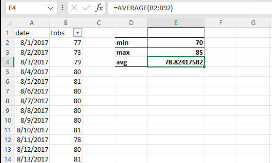

# sqlalchemy-challenge

In this project we will conduct a climate analysis on a destination. 

We will work on two parts:

1. Part 1: Analyze and Explore the Climate Data:

2. Part 2: Design a Climate App

## What we will learn from this project:

- How to use Python and SQLAlchemy to do a basic analysis and data exploration of a database. Specifically, we will use SQLAlchemy ORM queries, Pandas, and Matplotlib.
  
- How to design a Flask API based on the developed queries.

## Instructions:

Part1:

- Use the SQLAlchemy create_engine() function to connect to the provided SQLite database.

- Use the SQLAlchemy automap_base() function to reflect the tables into classes, and then save references to the classes.

- Link Python to the database by creating a SQLAlchemy session.

- Design queries.

- Load the query results into a Pandas DataFrame and plot the results.

Part2:

- Design a Flask API based on the developed queries by creation routes.

- Design queries and return JSON results

## Program:

### Tools:

- Python: is a programming language.

- Pandas: Python library designed for data manipulation and analysis. 

- matplotlib: Python library used for creating visualizations and plots.

- sqlalchemy: is a Python SQL toolkit and Object-Relational Mapping (ORM) library.

- Flask: is a micro web framework for Python for building web applications.

- jsonify: is a function provided by Flask that helps to convert Python dictionaries or objects into JSON.

- datetime:  is a module in Python's standard library that provides classes for working with dates and time.

- numpy: is a Python library for numerical and scientific computing.

### Code:

#### Part 1: Analyze and Explore the Climate Data

###### Reflect Tables into SQLAlchemy ORM

```
------------------------------------------------------------------------------------------------------------------------------------------------------------------------------------------------------------
#create engine to hawaii.sqlite
engine = create_engine("sqlite:///Resources/hawaii.sqlite")
------------------------------------------------------------------------------------------------------------------------------------------------------------------------------------------------------------
#reflect an existing database into a new model
Base = automap_base()
# reflect the tables
Base.prepare(autoload_with=engine)
------------------------------------------------------------------------------------------------------------------------------------------------------------------------------------------------------------
#view all of the classes that automap found
Base.classes.keys()
------------------------------------------------------------------------------------------------------------------------------------------------------------------------------------------------------------
#save references to each table
measurement = Base.classes.measurement
station= Base.classes.station
------------------------------------------------------------------------------------------------------------------------------------------------------------------------------------------------------------
# Create alink from Python to the database
session = Session(engine)
------------------------------------------------------------------------------------------------------------------------------------------------------------------------------------------------------------
```

##### Exploratory Precipitation Analysis

```
#query to retrieve the most recent date in the data set
date= session.query(measurement.date).order_by(measurement.date.desc()).first()
#display
date
------------------------------------------------------------------------------------------------------------------------------------------------------------------------------------------------------------
#query to retrieve the most recent date in the data set using pandas
d=pd.read_sql('SELECT max(date) as Latest_date FROM measurement', con=engine)
#display
['Latest_date']
------------------------------------------------------------------------------------------------------------------------------------------------------------------------------------------------------------
#design a query to retrieve the last 12 months of precipitation data and plot the results, starting from the most recent data point in the database. 

#calculate the date one year from the last date in data set.
lasty = dt.date(2017, 8, 23)-dt.timedelta(days=365)

#query to retrieve the data and precipitation scores
dp = session.query(measurement.date, measurement.prcp).filter(measurement.date>=lasty).all()

#save the query results as a Pandas DataFrame and set the column names
rst= pd.DataFrame(dp, columns =["date", "precipitation"])

#clean th dataframe from null values
rst1=rst.dropna()

#sort the dataframe by date
rt=rst1.sort_values('date')

#set the index of the DataFrame to the 'date' column
rt.set_index(rt["date"], inplace = True)

#plot the data
rt.plot(rot=90)
plt.xlabel('Date')
plt.ylabel('Inches')
plt.tight_layout()
plt.grid(True)
plt.show()
------------------------------------------------------------------------------------------------------------------------------------------------------------------------------------------------------------
#calculate the summary statistics for the precipitation data by using Pandas
rt.describe()
------------------------------------------------------------------------------------------------------------------------------------------------------------------------------------------------------------

```
##### Exploratory Station Analysis

```
------------------------------------------------------------------------------------------------------------------------------------------------------------------------------------------------------------
#query to calculate the total number of stations in the dataset
nbr_s=session.query(func.count(station.station)).all()

#display
nbr_s
------------------------------------------------------------------------------------------------------------------------------------------------------------------------------------------------------------
#query to find the most active stations by listing the stations and their counts in descending order.
st = session.query(measurement.station, func.count(measurement.station)).group_by(measurement.station).\
    order_by(func.count(measurement.station).desc()).all()
        
#display
st
------------------------------------------------------------------------------------------------------------------------------------------------------------------------------------------------------------
#calculate the lowest, highest, and average temperature using the most active station id from the previous query
#query to find the station with the highest number of observations
st1= session.query(measurement.station, func.count(measurement.station)).group_by(measurement.station).\
    order_by(func.count(measurement.station).desc()).first()
s=st1[0]

#query to calculate the lowest, highest, and average temperature for the most active station
active_session_info = session.query(func.min(measurement.tobs), func.max(measurement.tobs), func.avg(measurement.tobs)).\
    filter(measurement.station == s).all()
    
#display
active_session_info 
------------------------------------------------------------------------------------------------------------------------------------------------------------------------------------------------------------
#query the last 12 months of temperature observation data for the most active station
tp = session.query(measurement.tobs).filter(measurement.station == s).\
    filter(measurement.date >= lasty).all()
    
#create a Pandas DataFrame from the query results
tpd= pd.DataFrame(tp, columns = ["tobs"])

#plot a histogram of the Tobs
tpd = pd.DataFrame(tp, columns=["tobs"])
tpd.plot.hist(bins=12)
plt.xlabel("Temperature")
plt.ylabel("Frequency") 
plt.grid(True)
plt.tight_layout()
------------------------------------------------------------------------------------------------------------------------------------------------------------------------------------------------------------
#close Session
session.close()
------------------------------------------------------------------------------------------------------------------------------------------------------------------------------------------------------------
```
#### Part 2: Design Your Climate App
```

# Import the dependencies.
import sqlalchemy
from sqlalchemy.ext.automap import automap_base
from sqlalchemy.orm import Session
from sqlalchemy import create_engine, func
from flask import Flask, jsonify
import datetime as dt
import datetime as dt
import numpy as np
import pandas as pd
import datetime
#################################################
# Database Setup
#################################################
engine = create_engine("sqlite:///Resources/hawaii.sqlite")

# reflect an existing database into a new model
Base = automap_base()
# reflect the tables
Base.prepare(engine, reflect=True)

# Save references to each table
station = Base.classes.station
measurement = Base.classes.measurement

# Create our session (link) from Python to the DB
session = Session(engine)

#################################################
# Flask Setup
#################################################
app = Flask(__name__)

#################################################
# Flask Routes
#################################################
#start at the homepage and list all the available routes
@app.route("/")
def home():
   
    return (
        "<html>"
        "<body>"
        "<h1>Welcome Hawaii Climate API</h1>"
        
        "<h3>Precipitation:</h3>"
        "<p>/api/v1.0/precipitation</p>"
        
        "<h3>Stations:</h3>"
        "<p>/api/v1.0/stations</p>"
        
        "<h3>Temperature Observations:</h3>"
        "<p>/api/v1.0/tobs</p>"
        
        "<h3>Minimum, average, and maximum of the temperature for a specified start or start-end range:</h3>"
        "<p>/api/v1.0/start/end</p>"
        
        "</body>"
        "</html>"

    )

#convert a query results from  retrieving only the last 12 months of data to a dictionary using date as the key and prcp as the value.    
@app.route("/api/v1.0/precipitation")   
def precipitation():   
    
    # calculate the date one year from the last date in data set.
    lasty = dt.date(2017, 8, 23)-dt.timedelta(days=365)
    
    # perform a query to retrieve the data and precipitation scores
    dp = session.query(measurement.date, measurement.prcp).filter(measurement.date>=lasty).all()
    
    #close the session
    session.close()
    
    # create a dictionary
    list_d = []
    for date, prcp, in dp:
        date_dict = {}
        date_dict["date"] = date
        date_dict["prcp"] = prcp
        list_d.append(date_dict)
        
    #return the JSON representation of the dictionary
    return jsonify(list_d)

#return a JSON list of stations from the dataset
@app.route("/api/v1.0/stations")
def st():  
    
    #query the database to get station information
    st = session.query(station.station,station.name,station).all()
    
    #close the session
    session.close()  
    
    #convert the query result to a list
    list_st = [{"station": t[0], "name": t[1]} for t in st]
    
        
    #return a JSON list
    return jsonify(list_st)

#query the dates and temperature observations of the most-active station for the previous year of data.
@app.route("/api/v1.0/tobs")
def tobs():
    
    #calculate the date one year ago from  (August 23, 2017)
    lasty = dt.date(2017, 8, 23)-dt.timedelta(days=365)  
    
    #query the database to get temperature observations (tobs) for the most-active station 'USC00519281' for the previous year of data. 
    tob = session.query(measurement.tobs,measurement.date).\
        filter(measurement.station == 'USC00519281').filter(measurement.date>=lasty).all()
        
    #close the session
    session.close()
    
    #convert the query result to a list 
    list_tob = [{"tobs": t[0], "date": t[1]} for t in tob]
    
    #return a JSON list
    return jsonify(list_tob)
 

#return a JSON list of the minimum temperature, the average temperature, and the maximum temperature for a specified start-end dates range 
#defines an API endpoint that can accept one or two parameters for a specified start or start-end range
@app.route("/api/v1.0/<start>")
@app.route("/api/v1.0/<start>/<end>")
def start_end(start="", end=""):
    #use a try to look for invalid start date format
    try:
        #convert start to datetime
        start_date = dt.datetime.strptime(start, '%Y-%m-%d')
        
        #if the user gives an end date
        if len(end) > 0:
            
            #convert end to datetime
            end_date = dt.datetime.strptime(end, '%Y-%m-%d')
            
            #query to calculate min, avg, and max Tobs between start and end
            sel = [func.min(measurement.tobs), func.avg(measurement.tobs), func.max(measurement.tobs)]
            date_mes = session.query(*sel).\
                filter(measurement.date >= start).\
                filter(measurement.date <= end).all()
            
                
        #if the user doesn't give an end date
        else:
            #query to calculate min, avg, and max Tobs from start to last date
            sel = [func.min(measurement.tobs), func.avg(measurement.tobs), func.max(measurement.tobs)]
            date_mes = session.query(*sel).\
                filter(measurement.date >= start).all()
           
        
        #close the session
        session.close() 
        
        #convert the query result to a list
        list_m = [{"min": t[0], "average": t[1], "max": t[2]} for t in date_mes]
        
        #return a JSON list
        return jsonify(list_m)
    
    except ValueError:
        return jsonify({"error": "Invalid date"})


#run the Flask app
if __name__ == "__main__":
    app.run(debug=True)
```
### Hint:
In order of verification and using the learned tools, I used MS Excel to verify with a sample from hawaii_measurements table.

Results of the Min Max and Average of the temperature between start date: 2010-02-08 and end date: 2010-02-09
  


Results of the Min Max and Average of the temperature from start date: 2017-08-01 to last date: 2017-08-23

  

##### Supports: Slack AskBCS Learning Assistant/Tutoring support
